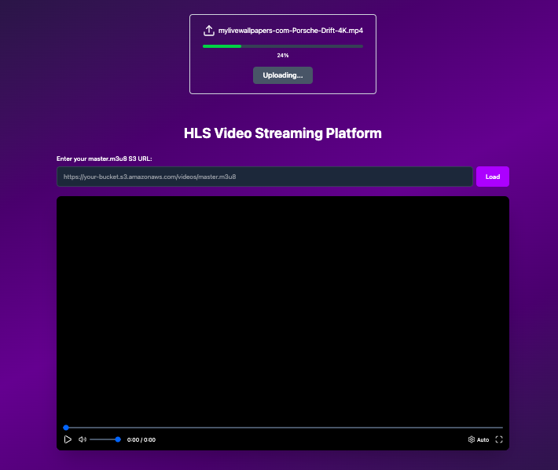

# 🎥 Video Transcoding HLS Platform

A scalable, cloud-native video transcoding platform that converts uploaded videos into HLS (HTTP Live Streaming) format with multiple quality levels. Built with microservices architecture using AWS services for seamless video processing and delivery.



## ✨ Features

- **🎬 Video Upload**: Drag-and-drop video upload interface with progress tracking
- **⚡ Multi-Quality Transcoding**: Automatic conversion to 360p, 480p, and 720p resolutions
- **📱 HLS Streaming**: Adaptive bitrate streaming for optimal viewing experience
- **☁️ Cloud-Native**: Built on AWS services (S3, ECS, SQS) for scalability
- **🎮 Custom Video Player**: React-based player with quality selection and controls
- **🔄 Asynchronous Processing**: Queue-based video processing for better performance
- **🐳 Containerized**: Docker-based deployment for easy scaling

## 🏗️ Architecture

The platform consists of four main microservices:

```
┌─────────────────┐    ┌─────────────────┐    ┌─────────────────┐
│   React Client  │    │   API Gateway   │    │   SQS Service   │
│                 │    │                 │    │                 │
│ • Upload UI     │◄──►│ • Presigned URL │◄──►│ • Queue Manager │
│ • Video Player  │    │ • CORS Handler  │    │ • ECS Trigger   │
│ • HLS Streaming │    │ • File Metadata  │    │ • Job Processor │
└─────────────────┘    └─────────────────┘    └─────────────────┘
         │                        │                        │
         │                        │                        ▼
         │                        │              ┌─────────────────┐
         │                        │              │ Video Transcoder│
         │                        │              │                 │
         │                        │              │ • FFmpeg Engine │
         │                        │              │ • Multi-res     │
         │                        │              │ • HLS Generator  │
         │                        │              │ • S3 Integration│
         │                        │              └─────────────────┘
         │                        │                        │
         │                        │                        ▼
         │                        │              ┌─────────────────┐
         │                        │              │   AWS Services  │
         │                        │              │                 │
         │                        │              │ • S3 Storage    │
         │                        │              │ • ECS Tasks     │
         │                        │              │ • SQS Queues    │
         │                        │              │ • CloudFront    │
         │                        │              └─────────────────┘
         │                        │
         ▼                        ▼
┌─────────────────────────────────────────────────────────────────┐
│                    Data Flow                                    │
│                                                                 │
│ 1. Upload Video → 2. Generate Presigned URL → 3. Store in S3  │
│ 4. Queue Message → 5. ECS Task → 6. Transcode → 7. HLS Output │
│ 8. Upload to CDN → 9. Stream to Player → 10. Cleanup          │
└─────────────────────────────────────────────────────────────────┘
```

### 1. **Frontend Client** (`/client`)

- React-based web application
- Video upload interface
- Custom HLS video player
- Real-time upload progress tracking

### 2. **API Gateway** (`/server/api`)

- Express.js REST API
- Handles presigned URL generation for S3 uploads
- CORS-enabled for frontend communication

### 3. **SQS Service** (`/server/sqs`)

- AWS SQS message processor
- Triggers ECS tasks for video processing
- Handles job queue management

### 4. **Video Transcoder** (`/server/video`)

- FFmpeg-based video processing
- Multi-resolution transcoding (360p, 480p, 720p)
- HLS playlist generation
- S3 integration for input/output handling

## 🛠️ Tech Stack

### Frontend

- **React 19** - Modern UI framework
- **Vite** - Fast build tool and dev server
- **Tailwind CSS** - Utility-first CSS framework
- **Lucide React** - Beautiful icons
- **Axios** - HTTP client
- **HLS.js** - HLS video streaming

### Backend

- **Node.js** - Runtime environment
- **Express.js** - Web framework
- **AWS SDK** - Cloud service integration
- **FFmpeg** - Video processing
- **Docker** - Containerization

### AWS Services

- **S3** - File storage and delivery
- **ECS** - Container orchestration
- **SQS** - Message queuing
- **IAM** - Access management

## 🚀 Quick Start

### Prerequisites

- Node.js 20+
- pnpm package manager
- Docker & Docker Compose
- AWS CLI configured
- FFmpeg installed

### 1. Clone the Repository

```bash
git clone https://github.com/yourusername/video-transcoding-hsl.git
cd video-transcoding-hsl
```

### 2. Environment Setup

Create `.env` files in each service directory:

**API Service** (`/server/api/.env`):

```env
AWS_ACCESS_KEY_ID=your_access_key
AWS_SECRET_ACCESS_KEY=your_secret_key
AWS_REGION=ap-south-1
BUCKET=your-temp-bucket
OUTPUT_BUCKET=your-output-bucket
```

**SQS Service** (`/server/sqs/.env`):

```env
AWS_ACCESS_KEY_ID=your_access_key
AWS_SECRET_ACCESS_KEY=your_secret_key
AWS_REGION=ap-south-1
SQS_QUEUE_URL=your_queue_url
ECS_CLUSTER=your_cluster_name
ECS_TASK_DEFINITION=your_task_definition
```

**Video Service** (`/server/video/.env`):

```env
AWS_ACCESS_KEY_ID=your_access_key
AWS_SECRET_ACCESS_KEY=your_secret_key
AWS_REGION=ap-south-1
BUCKET=your-temp-bucket
OUTPUT_BUCKET=your-output-bucket
```

### 3. Install Dependencies

```bash
# Install frontend dependencies
cd client
pnpm install

# Install API dependencies
cd ../server/api
pnpm install

# Install SQS service dependencies
cd ../sqs
pnpm install

# Install video service dependencies
cd ../video
pnpm install
```

### 4. Build Video Transcoder Image

```bash
cd server/video
docker build -t video-transcode:latest .
```

### 5. Run Services

**Development Mode:**

```bash
# Start API server
cd server/api
pnpm dev

# Start SQS processor
cd ../sqs
pnpm dev

# Start frontend
cd ../../client
pnpm dev
```

**Production Mode:**

```bash
# Use docker-compose for video transcoding
cd server/video
docker-compose up
```

## 📁 Project Structure

```
video-transcoding-hsl/
├── client/                 # React frontend
│   ├── src/
│   │   ├── components/     # React components
│   │   │   ├── Player.jsx  # HLS video player
│   │   │   └── UploadVideo.jsx
│   │   └── utils/          # API routes & constants
│   └── package.json
├── server/
│   ├── api/                # REST API gateway
│   │   ├── src/
│   │   │   ├── controllers/
│   │   │   ├── routes/
│   │   │   └── config/
│   │   └── package.json
│   ├── sqs/                # Message queue processor
│   │   ├── src/
│   │   │   ├── config/
│   │   │   └── utils/
│   │   └── package.json
│   └── video/              # Video transcoding service
│       ├── utils/
│       │   ├── transcode.js
│       │   ├── masterPlaylist.js
│       │   └── resolutions.js
│       ├── Dockerfile
│       └── docker-compose.yml
└── docs/                   # Documentation
```

## 🔄 Workflow

1. **Upload**: User uploads video through React frontend
2. **Presigned URL**: API generates S3 presigned URL for secure upload
3. **S3 Storage**: Video stored in temporary S3 bucket
4. **Queue Message**: SQS service sends processing message
5. **ECS Task**: Video transcoder container starts processing
6. **Transcoding**: FFmpeg converts video to multiple resolutions
7. **HLS Generation**: Creates adaptive bitrate playlists
8. **Output**: Processed videos uploaded to output S3 bucket
9. **Cleanup**: Original video removed from temp storage
10. **Playback**: Frontend player streams HLS content

## 🎯 Supported Formats

### Input Formats

- MP4, MOV, AVI, MKV, WebM
- Various codecs (H.264, H.265, VP9, etc.)

### Output Formats

- **360p**: 640×360, 800kbps video, 96kbps audio
- **480p**: 854×480, 1400kbps video, 128kbps audio
- **720p**: 1280×720, 2800kbps video, 128kbps audio

## 🚀 Deployment

### AWS ECS Deployment

1. Push Docker image to ECR
2. Create ECS task definition
3. Configure SQS queue
4. Set up S3 buckets with proper permissions
5. Deploy services using ECS service

### Environment Variables

Ensure all required AWS credentials and bucket names are configured in your deployment environment.

## 🤝 Contributing

1. Fork the repository
2. Create a feature branch (`git checkout -b feature/amazing-feature`)
3. Commit your changes (`git commit -m 'Add amazing feature'`)
4. Push to the branch (`git push origin feature/amazing-feature`)
5. Open a Pull Request

## 📚 Documentation

- [API Documentation](docs/API.md) - Complete API reference
- [Deployment Guide](docs/DEPLOYMENT.md) - Production deployment instructions
- [Contributing Guidelines](CONTRIBUTING.md) - How to contribute to this project

## 🙏 Acknowledgments

- FFmpeg for powerful video processing
- AWS for scalable cloud infrastructure
- React team for the amazing frontend framework
- HLS.js for seamless video streaming

---

**Built with ❤️ for scalable video processing**
